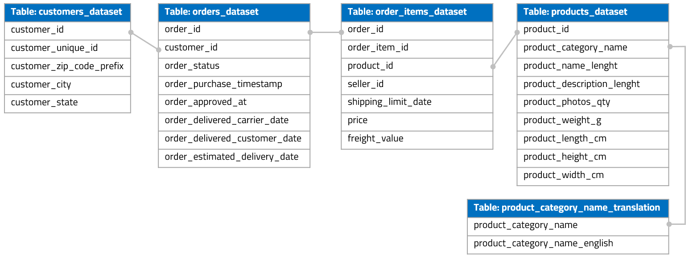

# SQL project: Brazilian E-Commerce

## Project Overview
This SQL project is to analyzes data from an e-Commerce business, such as customer segmentation by location, order pattern by day of the week, most popular item categories, etc.

### Business questions to be explored
1. Where are the customers distributed geographically? What are the cities / states that have the most customers?
2. Which days have the most order number? Are these related to holidays? How is the order number distributed across the different days of the week?
3. What are the most popular categories of items being ordered? 
4. What are the items that were delivered much slower than the estimation? What are the average differences between estimated delivery date and actual delivery date by month?


### Tables & Entity-Relationship Diagram (ERD)


## Data Analysis & SQL Codes

* **Query 1**: From the customer dataset table, find out the how many customers in each city and state, order by customer number in descending order 

```SQL
select
    customer_city,
    customer_state,
    count(*) as customer_number
from customers_dataset
group by customer_city, customer_state
order by customer_number DESC
```


---
* **Query 2**: Sort order number by day or by day of the week.

- (2a) Sort daily order number (convert timestamp to date) using "orders_dataset" table. Find the dates with the most orders purchased. (It's a black friday week)

```SQL
select
    cast(order_purchase_timestamp as date) as purchase_date,
    count(*) as order_number
from orders_dataset
group by purchase_date
order by order_number desc
```


- (2b) Sort order number for each day of the week. (While Monday has the most order number. Weekend has the least. The orders are roughly evenly distributed over the weekdays.)

```SQL
select
    TO_CHAR(order_purchase_timestamp, 'Day') as day_of_the_week,
    count(*) as order_number
from orders_dataset
group by day_of_the_week
order by order_number desc
```


---
* **Query 3**: Find the category has the most item ordered. Add english translation using the translation table.

```SQL
select
    prod.product_category_name as category_portuguese,
    trans.product_category_name_english as category_english,
    count(*) as order_number
from products_dataset prod
inner join order_items_dataset ord on prod.product_id = ord.product_id
inner join product_category_name_translation trans on prod.product_category_name = trans.product_category_name
group by prod.product_category_name, trans.product_category_name_english
order by order_number desc
```


---
* **Query 4**: For all delivered orders, calculate the difference between estimated delivery & actual delivery in days.
    
- (4a) List all the orders above that are more than 3 months late (180 days)
```SQL
select
    order_id,
    order_status,
    order_delivered_customer_date,
    order_estimated_delivery_date,
    order_estimated_delivery_date::date - order_delivered_customer_date::date as day_diff
from orders_dataset
where order_status = 'delivered' and 
    (order_delivered_customer_date is not null or order_estimated_delivery_date is not null) and
    (order_estimated_delivery_date::date - order_delivered_customer_date::date) <= -180
order by day_diff asc
```


- (4b) Get the average day difference (estimated delivery date - actual delivery date) by purchase month and year
```SQL
select
    purchase_year,
    purchase_month,
    avg(day_diff) as avg_day_diff
from(
    select
        order_id,
        order_status,
        order_purchase_timestamp,
        date_part('year', order_purchase_timestamp) as purchase_year,
        date_part('month', order_purchase_timestamp) as purchase_month,
        order_delivered_customer_date,
        order_estimated_delivery_date,
        order_estimated_delivery_date::date - order_delivered_customer_date::date as day_diff
    from orders_dataset
    where order_status = 'delivered' and 
        (order_delivered_customer_date is not null or order_estimated_delivery_date is not null)
) 
group by purchase_year, purchase_month
order by purchase_year, purchase_month
```
avg_day_diff = estimated delivery  - actual delivery (in days)

<small>
positive values: actual delivery is earlier than estimated

negative values: actual delivery is later than estimated
</small>


---
## Date source 
[https://www.kaggle.com/datasets/olistbr/brazilian-ecommerce](https://www.kaggle.com/datasets/olistbr/brazilian-ecommerce)